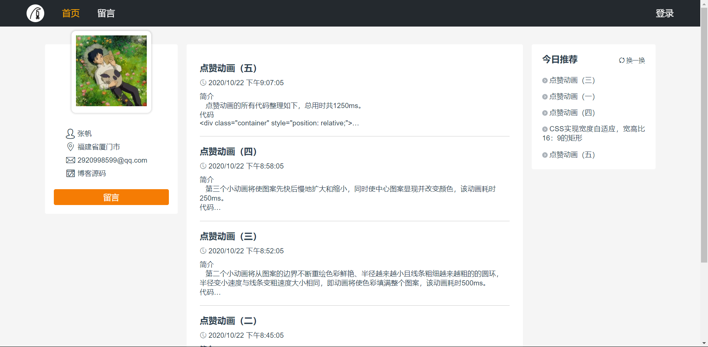
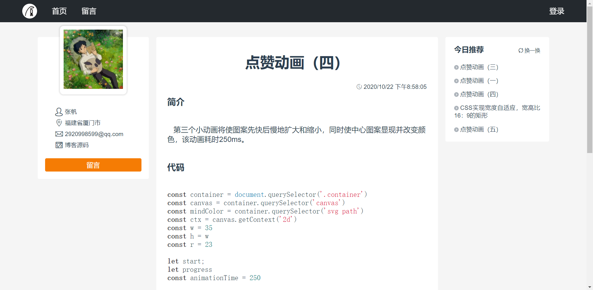
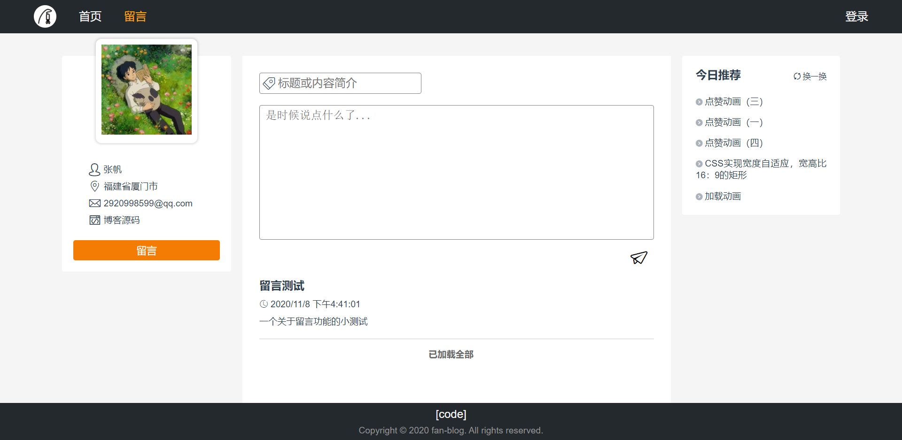

# fan-blog
Vue.js + Node.js + Mongodb 构建的前后端分离的个人博客<br>
前端主要技术栈为 vue.js、vue-router、vuex<br>
后端主要技术栈为 express、mongoose

### 项目界面
#### 浏览部分
首页<br>
<br>
文章详情<br>
<br>
留言功能<br>


### 功能介绍
#### 浏览页面
- 动态显示文章
- 新增留言
- 动态显示留言
- 随机推荐文章

### 技术概览
- **Vue**：前端渐进式框架。
- **Vuex**：专为 Vue.js 应用程序开发的状态管理模式。
- **ES6+**：采用ES6+语法，箭头函数、async/await等等语法很好用。
- **Less**：用Less做CSS预处理语言，可以使用最高效的方式，以少量的代码创建复杂的设计。

### 环境配置
- 数据库`mongodb`
- node

### 运行项目
克隆远程库
```
git clone https://github.com/funcater/fan-blog.git
```
启动`mongodb`数据库
```
mongodb --dbpath path\to\data
```
开启后端服务
```js
// fan-blog\server
npm install
npm run start
```
开启前端服务
```js
//fan-blog
npm install
npm run serve
```

### 作者
github：https://github.com/funcater
